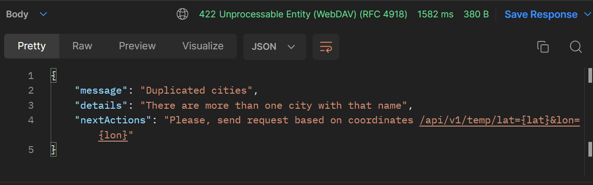

# Weather Retrieval app

This is a weather retrieval app build with Spring Boot. The purpose of this application is to expose an endpoint for current temperature retrieval for a given city provided by the user.

## Prerequisites

1. Spring Boot

## Requirements

- Tiny weather retrieval service.
- Temperature should be returned in 3 formats: Celsius, Fahrenheit, Kelvin.
- Temperature retrieval for a city provided by the user.

## Interact with the app

In order to send a request to the app it has to be started either by running
the `WeatherServiceApplication` or running the application in Docker.
The app will receive requests on port `8080`. There will be two endpoints available:

- `/api/v1/temp/lat={lat}&lon={lon}`  
  On a successful request to this one, a json is returned with the current temperature at that particular location.

- `/api/v1/temp/city={city}&country-code={city-code}`  
  On a successful request to the that one, there would be different scenarios.
  - If the response of 3rd party API provide couple of different locations based on different cities then an exception will be thrown indicating that a request to the coordinates endpoint will be required.
  - If the response have one location a json is returned with the current temperature.
  - If there is no such city or country code another exception will be thrown prompting that.

The temperature is provided in three different units `Fahrenheit, Celsius and Kelvin`.

## Input Validation

The application has input validation. Every request must comply with the format of the parameters.

- `/api/v1/temp/lat={lat}&lon={lon}` -> `{lat} and {lon}` should be numbers and should not be empty.
  **lat** should be between -90 and +90. **lon** should be between -180 and +180.
- `/api/v1/temp/city={city}&country-code={city-code}` -> `{city} and {city-code}` should be strings and should not be empty.

## Comunication with other API

The application is using [OpenweatherAPI](https://api.openweathermap.org) and [GeocodingAPI](https://openweathermap.org/api/geocoding-api).

- [OpenweatherAPI](https://api.openweathermap.org) is used to provide information on current temperatures.
- [GeocodingAPI](https://openweathermap.org/api/geocoding-api) is used to provide geocoordinates based on city input.

_Communication with third-party API could not garantee that the result would be correct_.

## Error handling

The application has a custom exception used in the special case of duplicated cities. As a correct result could not be guaranteed a custom exception was implemented. It provides information which enables the handling that problems.

**CityDuplicatesException.java** response:

